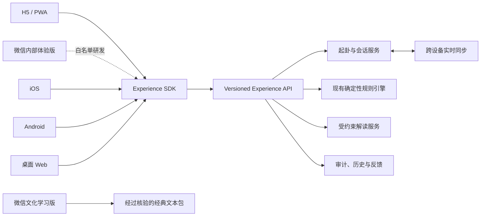

# 数智易学全平台沉浸式体验需求文档（PRD v3.0）

> 文档状态：规划版  
> 更新日期：2026-08-01  
> 上一版本：[PRD v2.0](divination_system_prd_v2.md)  
> 本次主题：从“功能可用”升级为“跨设备、强互动、可感知、可复盘”的全平台体验

## 0. 需求用语

- **必须（MUST）**：发布前不可缺失，否则不满足本版本验收。
- **应该（SHOULD）**：默认实现，只有明确的技术或成本原因才能降级。
- **可以（COULD）**：增强体验，不阻塞主版本发布。
- **动效、声音、触觉均不得参与易学规则计算**：它们只负责输入反馈、氛围和结果呈现。

---

## 1. 产品升级目标

### 1.1 产品北极星

让用户在任何设备上都能自然完成一次有“仪式感、真实感、可信感”的起卦：

1. 手机拿起来就能摇，系统能识别动作并给出同步的视觉、声音与触觉反馈。
2. 电脑端不仅是表单，还能通过 3D 铜钱、空间动效、键鼠操作或手机协同完成起卦。
3. 卦象出现时，用户先看懂结论，再按需进入盘面、原典和规则证据。
4. 所有炫酷效果都不能牺牲确定性规则、可访问性、隐私和低端设备可用性。

### 1.2 本版本核心成果

- 建立 Web/H5、PWA、微信文化学习小程序、内部体验小程序、iOS、Android、桌面浏览器的分层体验规范。
- 建立传感器、震动、声音、3D 渲染和跨设备协同的能力适配层。
- 将“手机摇卦”和“电脑扫码、手机摇、电脑同步展示”定义为旗舰体验。
- 将当前 Python 规则引擎沉淀为多端共享 API，不在各端重复实现易学规则。
- 为问事奇门、终身奇门和历史复盘增加适合不同终端的高互动呈现方式。
- 将公开微信小程序限定为《周易》经典学习；个性化互动只在独立 H5/PWA、桌面端和后续原生端提供。

### 1.3 非目标

- 不通过动效制造“神秘力量正在计算”的误导。
- 不允许摇动幅度、手机型号或传感器精度改变随机结果分布。
- 不默认采集或上传原始陀螺仪、加速度计、麦克风、摄像头数据。
- 不为了代码复用强行让所有平台使用完全相同的 UI。
- 不把 Streamlit 继续扩展成最终形态的高频移动端交互容器。
- 不通过隐藏功能、远程开关、伪装类目或公开体验版分发规避平台审核。

---

## 2. 核心产品决策

### 2.1 平台优先级

| 层级 | 平台 | 产品定位 | 结论 |
| --- | --- | --- | --- |
| P0 | 响应式 H5 / PWA | 最快触达、扫码即用、承接分享 | 先完成能力探测、摇动触发、3D 动画和完整降级 |
| P0 | 桌面 Web | 深度阅读、排盘、复盘、手机协同 | 作为分析主屏，不强求电脑具备运动传感器 |
| P1 | 微信文化学习小程序 | 《周易》原典与术语的公开学习入口 | 纯经典阅读，不接入个性化问题、随机生成、模型解释或互动 H5 跳转 |
| 内部 | 微信内部体验小程序 | 设备运动、震动与接口的白名单研发测试 | 不公开提审，不作为转发运营渠道 |
| P2 | iOS / Android 原生 App | 极致传感器、触觉、离线和系统级体验 | 使用平台原生能力，不以 H5 套壳代替 |
| P3 | 手表 / 可穿戴设备 | 实验性仪式入口与提醒 | 只做轻交互，不在手表上呈现完整排盘 |

### 2.2 技术边界

- 当前 Streamlit 版本继续承担：规则验证、运营后台、桌面演示和快速迭代。
- 新用户端采用独立前端，通过版本化 API 调用现有 Python 引擎。
- 共享内容包括：规则、接口协议、设计令牌、文案、埋点协议和跨端 SDK。
- 不共享的内容包括：各平台传感器权限、触觉实现、导航模式和系统组件。
- 手机“摇卦”主要依赖加速度/线性加速度识别摇动；陀螺仪或融合姿态用于判断旋转、倾斜和驱动视觉视差，不单独作为摇动判定依据。

---

## 3. 全平台能力矩阵

| 能力 | 桌面 Web | 手机 H5 / PWA | 微信文化学习小程序 | iOS 原生 | Android 原生 |
| --- | --- | --- | --- | --- | --- |
| 摇动识别 | 无则使用键鼠或手机协同 | 条件支持；必须先探测并在需要时请求权限 | 不使用 | Core Motion | Android Sensor Framework |
| 方向/倾斜视差 | 鼠标、触控板替代 | 条件支持 | 不使用 | 支持 | 支持 |
| 触觉反馈 | 通常无，使用视觉和声音 | 能力差异大，仅特性探测后启用 | 不使用 | UIKit / Core Haptics | HapticFeedback / VibrationEffect |
| 3D 铜钱物理动画 | 强 | 中高，按设备性能降级 | 不提供 | 强 | 强 |
| 空间音效 | 支持，需用户主动开启 | 支持，禁止自动播放 | 不使用 | 支持 | 支持 |
| 离线壳与缓存 | 可选 | PWA 支持部分离线 | 小程序包与缓存 | 完整支持 | 完整支持 |
| 推送/提醒 | 浏览器能力差异 | PWA 能力差异 | 不申请 | 系统通知 | 系统通知 |
| 快速分享 | 链接/二维码 | Web Share/链接 | 仅分享经典学习页面 | 系统分享 | 系统分享 |
| 极致体验等级 | A | B+ | 文化阅读 A | S | S |

能力实现必须遵循“先探测、再申请、可拒绝、可降级”。平台存在 API 不等于当前设备一定支持，也不等于用户已授权。

---

## 4. 旗舰体验一：手机沉浸式摇卦

### 4.1 用户旅程

1. 用户输入一个明确问题，选择时间范围。
2. 页面进入“静心准备”状态，说明需要连续完成六次摇动，第一次为初爻。
3. 用户点击“启用体感摇卦”，系统此时才申请设备运动权限。
4. 权限通过后进行 0.5–1 秒设备基线校准，不要求用户保持绝对静止。
5. 用户摇动手机；能量环、铜钱容器和环境声随动作强度变化。
6. 达到有效摇动阈值后，锁定本次安全随机种子，三枚铜钱进入物理碰撞动画。
7. 每枚铜钱落定时产生轻触觉与金属碰撞声；整爻确定后产生语义化触觉反馈。
8. 页面明确显示“第 N 次 / 共 6 次”“几正几反”“少阴/少阳/老阴/老阳”。
9. 六爻完成后，卦象从下至上组装，本卦与变卦以阴阳翻转动画出现。
10. 用户先看到白话结论，再展开五卦关系、盘面和原典。

### 4.2 状态机

`idle → permission_required → calibrating → ready → shaking → resolving → line_locked → next_line → completed`

异常状态：

- `permission_denied`：解释原因并提供“点按摇卦”和“手工录入”。
- `sensor_unavailable`：不反复请求权限，直接进入降级模式。
- `motion_too_weak`：使用温和提示，不判定为失败，不要求剧烈甩动。
- `interrupted`：来电、切后台或锁屏后暂停，恢复时重新校准当前一爻。
- `reduced_motion`：取消镜头旋转、粒子和大幅位移，保留文字、进度和必要淡入。

### 4.3 摇动识别要求

- 原始传感器数据只在本地内存中处理，MUST 不上传、不落库。
- 使用重力分离/高通滤波、滑动窗口和平滑处理，避免拿单个峰值直接判定。
- 有效摇动由“方向变化 + 能量累计 + 最短持续时间”共同判断。
- 阈值必须支持远程配置和机型分级，不在产品逻辑中写死单一数值。
- 同一次动作只能触发一次结果；进入 `resolving` 后立即停止监听。
- 每一爻结束后必须重新进入 `ready`，避免连摇误触发多爻。
- 必须覆盖坐姿、小幅单手摇、双手摇和无陀螺仪设备。

### 4.4 随机性与可审计性

- 运动传感器只决定“何时触发”和“动画能量”，不得直接决定正反面。
- 每次起卦使用密码学安全随机源生成种子；六次结果由同一会话种子按序派生。
- 服务端保存种子摘要、算法版本、触发时间和结果，不保存可反推出用户动作的原始数据。
- 结果生成后再播放物理动画；物理引擎不得反向修改已确定结果。
- 可选 P2：采用 commit-reveal，起卦开始时显示随机承诺摘要，结束后允许用户验证结果未被中途替换。
- 断网时允许本地安全随机起卦，恢复网络后上传审计摘要并标记“离线生成”。

---

## 5. 旗舰体验二：电脑与手机协同摇卦

### 5.1 适用场景

用户在电脑上阅读和分析，但希望通过手机完成真实的体感摇卦。

### 5.2 用户旅程

1. 电脑端选择“用手机摇卦”。
2. 电脑生成一次性二维码和六位短码，二维码不得包含用户问题明文。
3. 手机扫码打开 H5，无需强制登录即可加入本次临时会话。
4. 手机显示摇动、触觉和单爻结果；电脑同步显示 3D 铜钱、卦爻组装和进度。
5. 六爻完成后，手机进入简版结论，电脑进入完整盘面与解读。
6. 用户可选择把本次记录绑定到账号；未绑定的临时会话到期自动清理。

### 5.3 技术与安全要求

- 使用短时效签名会话令牌，默认有效期 5 分钟，首次连接后即失效于其他设备。
- WebSocket 或等价实时通道同步状态，服务端只接受合法的状态迁移。
- 二维码泄露时，用户可在电脑端立即“断开并换码”。
- 网络抖动时手机先完成本地动画，恢复后按序补发事件；不得重复生成爻结果。
- 电脑与手机结果必须使用相同 `run_id`、种子摘要和规则版本。
- 跨设备进度同步延迟目标：P95 小于 300ms。

---

## 6. 无传感器与低能力设备的高质量降级

### 6.1 点按虚拟摇卦

- 长按“聚气”，松手触发铜钱运动；按压时间只影响动画，不影响结果分布。
- 支持连续点击六次的快速模式，也支持完整仪式模式。
- 每次结果同时显示文字，不要求用户认识阴爻和阳爻符号。

### 6.2 拖拽/甩动铜钱

- 桌面端可用鼠标或触控板拖动铜钱容器，释放速度驱动物理动画。
- 移动端在关闭运动权限时可用单指上滑“抛铜钱”。
- 拖拽力度只影响视觉速度、旋转次数与声音密度。

### 6.3 手工录入

- 保留“几正几反”和“老少阴阳”两种录入方式。
- 默认推荐“几正几反”，由系统换算爻态。
- 明确提示从初爻到上爻的顺序，并在每次录入后展示累计卦形。

### 6.4 无动效快速模式

- 用户可一次点击完成单爻或六爻，结果仍具备完整审计信息。
- 系统检测到低性能、低电量、`prefers-reduced-motion` 或用户主动关闭时自动启用。

---

## 7. 视觉、声音与触觉系统

### 7.1 视觉语言

- 延续“传统易经文化 × 克制赛博仪器”：深墨黑、旧铜金、冷科技蓝。
- 传统元素采用真实材质、书法排版、卦爻结构和天文仪器隐喻，不使用廉价霓虹与满屏符号。
- 3D 铜钱必须具有厚度、重量、磨损和碰撞感，不做悬浮贴图。
- 结果揭晓从“局部事实”逐层展开为“单爻 → 六爻 → 本卦 → 变卦 → 五卦关系”。

### 7.2 动效语法

| 事件 | 动效 | 目的 |
| --- | --- | --- |
| 进入准备状态 | 仪器刻度缓慢归零 | 提示尚未开始监听 |
| 摇动中 | 能量环跟随动作，但有限幅 | 让用户知道动作已被识别 |
| 有效触发 | 容器短促收束后释放铜钱 | 建立动作与结果的因果感 |
| 铜钱落定 | 分别减速、碰撞、停止 | 让三枚结果清晰可读 |
| 单爻锁定 | 爻线从中间向两侧生成 | 强化阴阳结构 |
| 动爻 | 爻线在锁定后发生一次克制翻转 | 说明“变化”，不做持续闪烁 |
| 六爻完成 | 镜头拉远，卦象进入盘面 | 从仪式自然过渡到分析 |

- 动画必须由明确状态驱动，不用随机定时器拼接。
- 关键动效必须可中断、可跳过、可重播。
- 禁止超过 3 次/秒的闪烁；禁止用快速旋转强迫用户观看。

### 7.3 触觉语义

| 事件 | 推荐反馈 | 降级 |
| --- | --- | --- |
| 按钮确认 | 极轻点击 | 无触觉 |
| 达到有效摇动 | 中等单脉冲 | 视觉边框收束 |
| 单枚铜钱落定 | 轻触点 | 碰撞声/高亮 |
| 一爻锁定 | 双短脉冲 | 爻线生成动画 |
| 动爻出现 | 短—停—重 | “动爻”文字与图标 |
| 六爻完成 | 成功序列 | 完成音与结果标题 |
| 权限/网络异常 | 警告序列，不使用强震 | 明确错误文案 |

- 触觉必须遵循系统设置和用户开关。
- 高频操作优先使用平台预定义反馈；不支持清晰触觉时宁可不震动，也不使用长时间“嗡嗡震动”。
- 触觉、声音和视觉必须同步，允许按平台硬件能力选择不同实现。

### 7.4 声音系统

- 默认关闭环境声，用户首次主动开启后才允许播放。
- 铜钱碰撞声根据材质、速度和接触面分层，结果确定后不再随机改变音色。
- 可选环境声只保留低密度风声、木质空间和仪器运转声，不使用持续诵经或制造恐惧的音效。
- 声音必须有独立开关，并服从静音模式、无障碍设置和网页自动播放限制。

---

## 8. 桌面端极致体验

### 8.1 主屏布局

- 左侧：问题、起卦方式和时空坐标。
- 中央：可交互 3D 铜钱/九宫仪器主舞台。
- 右侧：当前单爻、六爻进度、来源标识和白话提示。
- 结果阶段切换为“白话结论 + 盘面证据”的双栏结构。

### 8.2 输入方式

- 鼠标拖拽或触控板甩动铜钱容器。
- 按住空格键蓄力、松开起卦；提供键盘焦点和屏幕阅读器提示。
- 手机扫码协同摇卦作为推荐入口。
- 可以提供鼠标视差和轻微镜头跟随，但不得影响正文阅读。

### 8.3 深度阅读

- 五卦关系使用可展开关系图：本卦为中心，变/互/综/错为四个分支。
- 指向某一卦时，高亮其六爻编码如何变化，并显示“确定性计算”来源。
- 终身奇门使用可拖动时间轴查看大运、流年、流月；切换年份时给出轻微吸附反馈。
- 历史记录支持对比两次结果、查看当时问题条件是否发生变化。

---

## 9. 手机端与微信双工程体验

### 9.1 单手优先

- 核心按钮位于拇指舒适区，支持左右手模式。
- 起卦阶段全屏沉浸，隐藏非必要导航；退出时保留当前六爻进度。
- 每次摇动后提供足够大的“继续下一爻”按钮，避免自动连跳。

### 9.2 微信文化学习小程序

- 浏览、检索六十四卦卦名、卦序、卦辞、彖传、象传与爻辞。
- 提供阴阳、八卦、重卦、卦辞、彖传、象传和爻位等阅读术语。
- 展示公共领域底本、交叉核验来源和数据库完整性指纹。
- 不收集个人问题，不随机生成内容，不输出个性化结论，不调用模型，不跳转完整互动 H5。

### 9.3 微信内部体验小程序

- 保留设备运动、短震动、点按降级、断点恢复与异步接口联调能力。
- 只向管理员、开发者和白名单体验成员开放，用于研发和真实设备测试。
- 工程名称、界面和文档必须持续显示“内部体验版”，禁止作为公开审核包。

### 9.4 原生 App 专属能力

- iOS 使用 Core Motion 获取融合后的设备运动，使用 UIKit/Core Haptics 设计低延迟触觉。
- Android 使用运动传感器框架和系统动作语义触觉；高级触觉必须先检查硬件能力。
- 支持离线完成起卦、规则排盘、历史查看，联网后再生成模型解读。
- 支持系统分享、深色模式、动态字体、语音辅助和本地加密存储。

### 9.5 实体与空间计算扩展（P3 实验）

- **实体铜钱识别**：用户把三枚真实铜钱放在桌面，手机在本地识别正反面；低置信度时必须让用户逐枚确认，不得自动写入错误爻态。
- **AR 桌面模式**：将铜钱、六爻或九宫仪器放置在真实桌面，只承担呈现，不读取环境内容用于解读。
- **手表遥控**：手表用于开始/确认单爻、输出简短触觉和接收复盘提醒；完整问题与盘面仍在手机或电脑查看。
- **实体配件**：可以评估 NFC/蓝牙铜钱盘或震动底座，但必须使用公开协议；配件缺失不得削弱软件核心功能。
- 摄像头画面默认只在端侧处理，不上传、不保存；首次使用必须说明识别范围并提供普通手工录入替代。

---

## 10. 奇门与复盘的高互动升级

### 10.1 问事奇门

- 九宫盘支持点击宫位后“聚焦放大”，先显示白话角色，再展开门、星、神、天盘和地盘。
- 手机倾斜只用于轻微空间视差，不改变盘面位置和断语。
- 提供“现在怎么做 / 需要避开什么 / 依据在哪一宫”三个固定视角。
- 宫位之间的生克、门星组合使用连线和图例表达，不只依赖颜色。

### 10.2 终身奇门

- 首屏先显示当前年龄对应的大运、流年和一句话结论。
- 手机采用纵向时间河流；桌面采用横向多层时间轴。
- 滑入新年份时可以使用轻触觉吸附；快速滑动停止后再计算和渲染详情。
- 明确说明流年起始年份、起运年龄和计算依据，避免用户把索引年当作实岁。

### 10.3 历史复盘

- 支持“重播起卦过程”，但重播必须读取原结果，不重新随机。
- 支持为历史结果添加现实事件时间点，并与当时建议并排比较。
- 分享默认隐藏问题全文、经纬度、出生信息和 `run_id` 完整值。

---

## 11. 多端统一架构

### 11.1 推荐实现

- **Web/H5/PWA**：React + TypeScript；GSAP 管理状态动效；Three.js 或等价 WebGL 引擎管理铜钱物理舞台。
- **微信文化学习小程序**：原生离线阅读页面 + 由主数据库生成的经典文本包；不连接 Experience API。
- **微信内部体验小程序**：原生传感器和触觉验证壳 + Experience API；不进入公开审核流程。
- **iOS**：SwiftUI + Core Motion + UIKit/Core Haptics 适配层。
- **Android**：Jetpack Compose + Sensor Framework + 平台触觉 API。
- **服务端**：从现有 Python 项目拆出 FastAPI 或等价版本化 API；规则数据库、历法和 Guardrails 保持单一事实来源。
- **实时同步**：WebSocket；模型长文本使用 SSE 或流式 HTTP，与摇卦同步通道分离。

### 11.2 Experience SDK 接口

- `MotionAdapter`：能力探测、权限、校准、开始/停止监听、标准化动作事件。
- `HapticAdapter`：语义事件到平台触觉的映射、能力降级和用户设置。
- `AudioAdapter`：解锁音频、音效预加载、静音和低功耗策略。
- `RendererAdapter`：高/中/低三档渲染质量、暂停和销毁。
- `CastSessionAdapter`：会话、种子承诺、单爻锁定、断线恢复。
- `CrossDeviceAdapter`：二维码配对、实时状态、重连和会话失效。

### 11.3 最小 API 契约

- `POST /v1/cast-sessions`：创建起卦会话，返回 `run_id`、会话令牌和随机承诺摘要。
- `POST /v1/cast-sessions/{id}/lines`：按顺序锁定一爻，服务端保证幂等。
- `POST /v1/cast-sessions/{id}/complete`：完成排盘并返回确定性结果。
- `GET /v1/runs/{run_id}`：读取盘面、来源层和解读状态。
- `GET /v1/runs/{run_id}/stream`：流式返回受约束解读。
- `POST /v1/pairing-sessions`：创建电脑—手机临时配对。
- `WS /v1/pairing-sessions/{id}`：同步动作状态、单爻结果和完成事件。

所有写接口必须支持幂等键；客户端重试不得多生成一爻或多创建一次审计记录。

---

## 12. 权限、隐私与安全

### 12.1 权限原则

- 权限必须在用户主动点击相关功能后请求，禁止首屏弹窗。
- 请求前用一句话解释用途：“仅在本机识别摇动，不保存原始运动数据”。
- 拒绝后仍能完整使用点按、拖拽和手工录入。
- 不循环诱导用户开启权限，不用“不开就不能用”的虚假阻断。

### 12.2 数据最小化

- 原始加速度、角速度、姿态采样不得离开设备。
- 审计仅保存：能力类型、是否授权、标准化触发事件、算法版本和结果摘要。
- GPS、出生信息、用户问题和传感器权限分开授权、分开存储。
- 分享卡片默认脱敏；用户必须二次确认才能包含问题全文。

### 12.3 安全要求

- 配对令牌短时有效、单次使用、服务端可撤销。
- 客户端不能提交最终卦名，只能提交会话动作；卦象由服务端规则引擎确认。
- API 密钥、模型密钥和小程序密钥只能保存在服务端。
- 防重放、防越权读取历史、限制批量起卦与异常自动化请求。

---

## 13. 可访问性与身体安全

- 动效遵循 `prefers-reduced-motion` 和系统“减少动态效果”。
- 提供“关闭动效”“关闭声音”“关闭触觉”“快速起卦”独立设置。
- 不要求用力甩动；提供小幅动作校准和无动作替代。
- 页面提醒用户在安全、稳定的环境中操作，不在驾车或行走时摇动设备。
- 所有动爻、风险和状态必须同时使用文字/图标，不能只靠颜色、声音或震动。
- 支持动态字体、屏幕阅读器、键盘导航、浏览器放大和高对比模式。
- 3D 场景不阻塞表单和结果正文；WebGL 失败时自动切换为 2D 动画。

---

## 14. 性能与体验指标

| 指标 | 目标 |
| --- | --- |
| H5 首次可交互 | 4G 中端机 P75 ≤ 2.5 秒 |
| 起卦按钮到视觉响应 | P95 ≤ 100ms |
| 原生有效摇动到首个触觉反馈 | P95 ≤ 60ms |
| 微信内部体验版/H5 有效摇动到视觉反馈 | P95 ≤ 120ms |
| 3D 主舞台帧率 | 中高端设备稳定 60fps；低端降级后 ≥ 30fps |
| 单次完整六爻仪式 | 中位数 ≤ 90 秒 |
| 快速六爻模式 | 中位数 ≤ 20 秒 |
| 跨设备状态同步 | P95 ≤ 300ms |
| 起卦会话恢复成功率 | ≥ 99% |
| 无崩溃会话率 | ≥ 99.8% |
| 规则结果一致性 | 全平台同一输入 100% 一致 |

体验指标：

- 起卦完成率。
- 运动权限申请后的授权率与拒绝后的降级完成率。
- 平均每爻重试次数、动画跳过率、声音/触觉关闭率。
- 手机协同配对成功率、扫码到首个同步事件耗时。
- 结果页继续追问率、历史复盘率和事后反馈率。

指标用于优化体验，不得用于强化宿命论、焦虑或诱导反复占问。

---

## 15. 埋点事件

- `capability_checked`
- `motion_permission_prompted / granted / denied`
- `motion_calibration_started / completed / failed`
- `shake_started / valid_shake_detected / shake_cancelled`
- `coin_animation_started / skipped / degraded`
- `line_locked`
- `cast_completed / cast_resumed`
- `haptic_enabled / disabled / unavailable`
- `audio_enabled / disabled / unavailable`
- `pairing_created / joined / reconnected / expired`
- `result_plain_viewed / evidence_expanded`
- `history_replayed / feedback_submitted`

埋点不得包含原始问题、原始传感器序列、精确经纬度、出生信息和完整 `run_id`。

---

## 16. 分阶段交付

### 第一批实现范围（已确认）

第一批不是只做底层接口，而是同时交付一个可验证的旗舰体验闭环：

1. **P0 技术拆分**：版本化 Experience API、安全随机承诺、六爻顺序派生、单爻幂等、匿名临时会话、规则引擎复用与自动化契约测试。
2. **手机摇卦 MVP**：设备运动能力探测、用户主动授权、本机动作识别、条件震动、减少动态适配，以及无需传感器也能完成六爻的点按降级。
3. **电脑—手机协同 MVP**：电脑创建问题和短时配对，二维码/六位码加入，WebSocket 同步每一爻，六爻完成后两端使用同一 `run_id` 和确定性结果。

第一批暂不包含真实物理引擎级 3D 铜钱、分层声音、账号绑定和原生 App；微信文化学习版与内部体验版作为互相隔离的独立工程推进。

第一批成功标准：本地自动化测试覆盖随机承诺、幂等、配对授权、六爻一致性和 API/WebSocket 主流程；桌面与手机真机各完成至少一次端到端验收后，方可进入公开环境。

### P0：体验基础与架构拆分

- 将确定性排盘能力暴露为版本化 API。
- 建立能力探测、动作事件、触觉事件和渲染质量协议。
- 完成安全随机、幂等单爻和传感器数据不出端。
- 建立真实设备测试矩阵和自动化规则一致性测试。

### P1：H5/PWA + 桌面手机协同

- 完成手机摇卦、点按降级、3D 铜钱、声音和条件触觉。
- 完成电脑扫码、手机摇、电脑实时同步。
- 完成桌面五卦关系图和移动端结果页。
- 支持匿名临时会话与账号绑定。

### P2：微信双工程

- 文化学习版完成 64 卦检索、原典详情、术语和来源核验，并通过平台当期规则人工复核。
- 内部体验版完成设备运动、震动、包体、低端机和微信版本兼容测试，但不提交公开审核。
- 两个工程使用独立 AppID、工程目录和发布流程，禁止通过远程配置互相切换功能。

### P3：iOS / Android 原生极致版

- 完成融合运动识别、低延迟语义触觉和离线规则包。
- 完成系统分享、通知、动态字体和本地加密。
- 评估手表端轻量摇卦触发、触觉确认、实体铜钱端侧识别、AR 桌面模式和复盘提醒。

---

## 17. 验收场景

### 17.1 手机体感摇卦

- 在支持设备运动的手机上，用户授权后可以连续完成六爻，且不会一次动作触发多爻。
- 用户拒绝权限后，页面无需刷新即可切换点按模式并完成同样流程。
- 开启减少动态效果后，没有快速旋转和粒子场，结果文字、正反面与爻态仍完整。
- 关闭触觉和声音后，所有步骤仍有明确视觉与文字反馈。

### 17.2 随机与审计

- 相同种子和算法版本在所有平台产生一致的六爻结果。
- 改变摇动幅度只改变动画强度，不改变已经承诺的结果。
- 网络重试、页面恢复和跨设备重连不会重复生成爻。
- 历史重播与原记录完全一致，不重新随机。

### 17.3 电脑手机协同

- 扫码后手机 5 秒内加入会话；电脑和手机显示相同的爻序与结果。
- 二维码过期、被第二台设备使用或用户主动换码时有明确提示。
- 手机断网恢复后能够补齐事件，电脑不生成重复结果。

### 17.4 低能力与异常设备

- 无陀螺仪、禁用运动权限、无震动、WebGL 失败和低性能设备均能完成起卦。
- 低端设备自动降级后，输入、结果、原典和审计能力不减少。
- 任何平台发生模型错误时，确定性盘面仍显示并可在原记录上重试。

---

## 18. 测试矩阵

- iPhone：当前与上一主要 iOS 版本，Safari、PWA、微信内小程序。
- Android：主流高端、中端、低端机；Chrome、微信内部体验版；有/无陀螺仪。
- 桌面：Windows Chrome/Edge、macOS Safari/Chrome，鼠标与触控板。
- 辅助场景：减少动态效果、系统关闭触觉、静音、动态字体、屏幕阅读器、弱网、断网、后台恢复。
- 每次发布至少完成一轮真实设备六爻流程；模拟器不能替代传感器和触觉验收。

---

## 19. 主要风险与控制

| 风险 | 影响 | 控制策略 |
| --- | --- | --- |
| H5 运动/震动能力碎片化 | 不同浏览器体验不一致 | 特性探测、权限前置说明、点按降级；不使用公开文化小程序承接互动功能 |
| 微信内容政策边界 | 审核拒绝、下架或主体受限 | 文化版与内部体验版物理隔离；文化版无个人输入、随机生成、模型解释和互动 H5 跳转 |
| iOS 运动权限需要用户手势触发 | 自动监听失败 | 只在用户点击“启用体感”后请求 |
| 低端机 3D 掉帧或发热 | 卡顿、耗电、眩晕 | 质量分档、对象池、暂停后台渲染、2D 降级 |
| 触觉在不同硬件上差异大 | 反馈含义不一致 | 使用语义事件与平台预定义效果，能力检测 |
| 用户过度用力摇动 | 身体或设备风险 | 小幅校准、低阈值、明确安全提示、点按替代 |
| 动效被误认为影响卦象 | 信任受损 | 明确“动作触发、规则计算”，提供随机承诺与审计 |
| 多端规则漂移 | 同题不同结果 | 规则只在服务端和版本化离线包中维护，契约测试 |
| 跨设备二维码泄露 | 会话被接管 | 短时令牌、单设备绑定、电脑端撤销与换码 |

---

## 20. 官方能力依据

- Web 设备方向与运动事件：[W3C Device Orientation and Motion](https://www.w3.org/TR/orientation-event/)
- Web 震动接口：[W3C Vibration API](https://www.w3.org/TR/vibration/)
- iOS Safari 运动权限需要显式请求：[WebKit Safari 13 features](https://webkit.org/blog/9674/new-webkit-features-in-safari-13/)
- iOS 运动数据：[Apple Core Motion](https://developer.apple.com/documentation/coremotion/)
- iOS 自定义触觉：[Apple Core Haptics](https://developer.apple.com/documentation/corehaptics/)
- iOS 语义触觉：[Apple UIFeedbackGenerator](https://developer.apple.com/documentation/uikit/uifeedbackgenerator)
- Android 运动传感器：[Android Motion sensors](https://developer.android.com/develop/sensors-and-location/sensors/sensors_motion)
- Android 触觉能力与降级：[Android Haptics API](https://developer.android.com/develop/ui/views/haptics/haptics-apis)
- 微信内部体验版设备运动监听：[wx.startDeviceMotionListening](https://developers.weixin.qq.com/miniprogram/dev/api/device/motion/wx.startDeviceMotionListening.html)
- 微信内部体验版短震动：[wx.vibrateShort](https://developers.weixin.qq.com/miniprogram/dev/api/device/vibrate/wx.vibrateShort.html)
- 微信小程序常见拒绝情形：[微信开放文档](https://developers.weixin.qq.com/miniprogram/product/reject.html)

---

## 21. v3.0 完成定义

1. H5/PWA、桌面、内部体验版和原生客户端使用同一规则契约；公开文化版只使用经过哈希核验的经典文本包。
2. 手机体感、点按降级、手工录入三条起卦路径均可独立完成六爻。
3. 电脑—手机配对、断线恢复、二维码失效和结果一致性通过端到端测试。
4. 原始运动数据不出端，权限拒绝不影响核心功能。
5. 视觉、声音、触觉均具有独立开关、能力探测和无障碍替代。
6. H5、微信内部体验版、iOS、Android 和桌面完成真实设备矩阵验收；微信文化版独立完成内容与审核验收。
7. 线上监控能够区分规则失败、权限失败、渲染降级、网络失败和模型失败。
8. 用户可以从白话结论进入盘面证据、原典来源和历史复盘，炫酷体验不遮蔽可信度。
